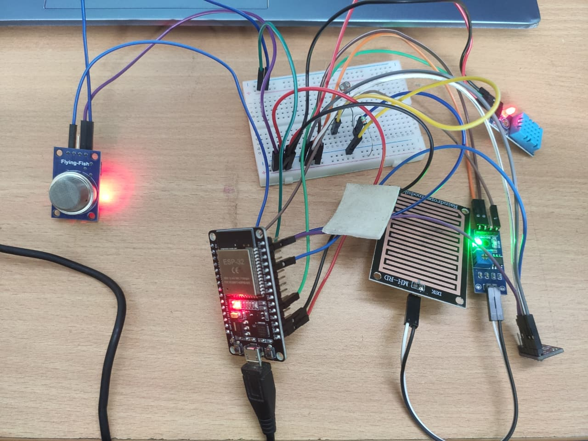
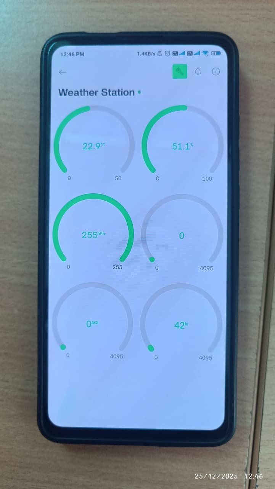
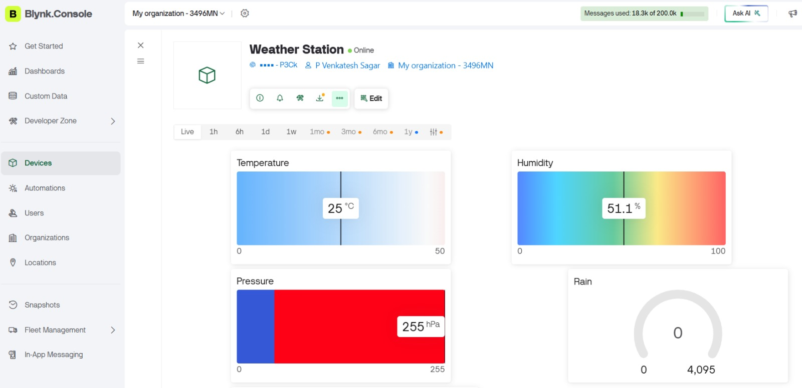

# ESP32 IoT Weather Monitoring System

## 📌 Overview

This project is an IoT-based weather monitoring system developed using ESP32 and DHT11 sensors. The system collects real-time environmental data such as temperature and humidity and transmits it to cloud platforms for remote monitoring and visualization.

---

## 🚀 Features

- Real-time temperature monitoring
- Real-time humidity monitoring
- Wi-Fi connectivity using ESP32
- Blynk cloud integration
- Web dashboard monitoring
- Remote access to sensor data
- Low-cost IoT solution

---

## 🛠 Hardware Components

- ESP32 Development Board
- DHT11 Temperature & Humidity Sensor
- Breadboard
- Jumper Wires
- USB Cable

---

## 💻 Software Used

- Arduino IDE
- Blynk IoT Platform
- Web Dashboard

---

## ⚙️ Working Principle

1. DHT11 sensor measures temperature and humidity.
2. ESP32 reads sensor values.
3. Data is transmitted via Wi-Fi.
4. Values are displayed on Blynk dashboard.
5. Data can be monitored remotely through web and mobile interfaces.

---

## 📊 Applications

- Smart Agriculture
- Weather Monitoring Stations
- Greenhouse Monitoring
- Environmental Monitoring
- Smart Homes

---

## 🎯 Skills Gained

- ESP32 Programming
- Sensor Interfacing
- IoT Communication
- Cloud Integration
- Real-Time Data Processing
- Hardware Debugging

---

## 📷 Project Images

### Hardware Setup

### Blynk Mobile Dashboard

### Blynk Web Dashboard

---

## 👨‍💻 Author

**P. Venkatesh Sagar**  
Embedded Systems & Robotics Engineer

LinkedIn: www.linkedin.com/in/p-venkatesh-sagar-528715256

